# The web console

The console is the instrument with a browser in front of it. It ships as its
own container image, reads the catalogue and the vendored specification text
from paths you mount, and reaches the engine only through the published
`veredictum` crate: every number it shows is one the command line prints too.

Every screenshot below is captured by the console's own browser journeys
(`scripts/ui-e2e.sh` with `UI_E2E_DOCS_SHOTS=1`), in one 1440×900 browser
window, light and dark. They are refreshed in the pull request that changes the
interface, so what you see here is the interface that shipped.

A capture pass serves the console in capture mode, where the three facts one
run stamps show fixed stand-ins: the run clock reads `00:00`, a record digest
reads as all zeros, and a signing time reads `1970-01-01T00:00:00Z`. Your own
runs show the real values, and a sealed record always carries them: the mode
changes what the screen displays, never what is written, sealed or signed. It
exists so a capture pass over an unchanged interface produces identical
images, which is what makes a screenshot diff mean something.

## The landing

The four counts are the catalogue's own: case cores, operation bindings,
capability-matrix rows, and validate findings. A findings count above zero means the
catalogue itself needs attention before any server is graded.

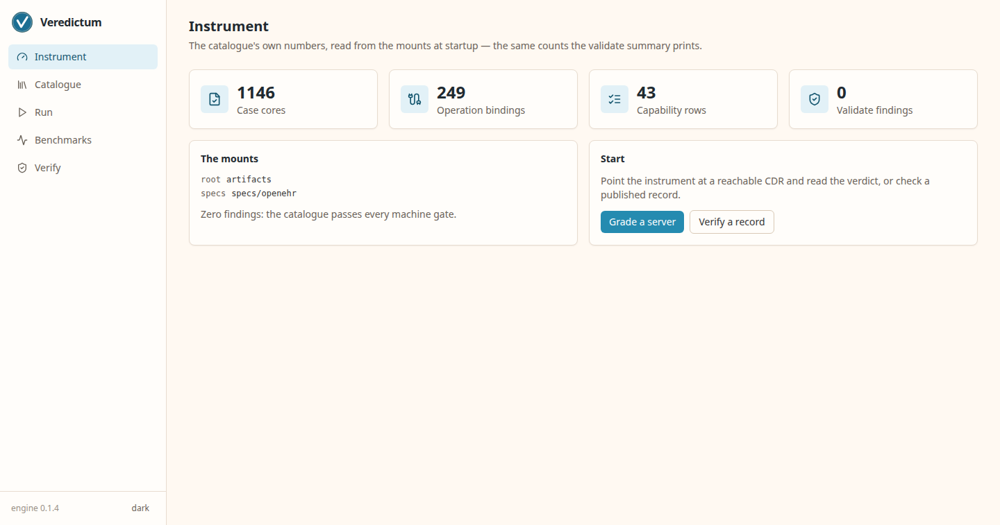
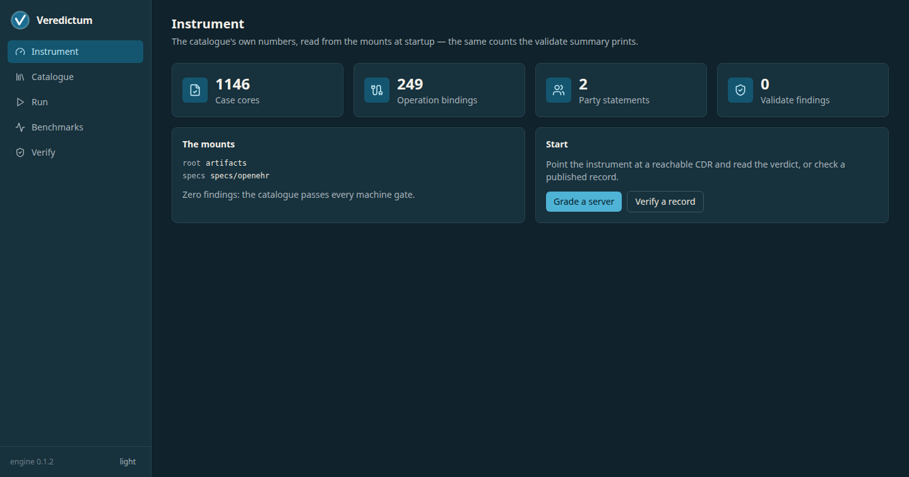

## The catalogue explorer

Chapters first, each with the number of cases it carries. The search and page
state live in the URL, so a view is shareable and survives a refresh.

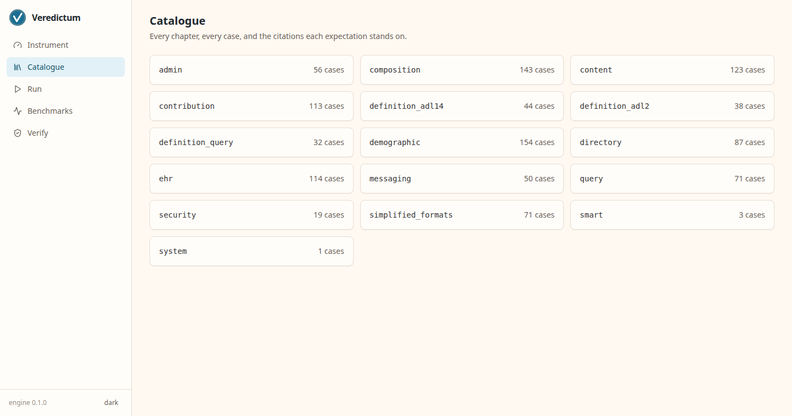
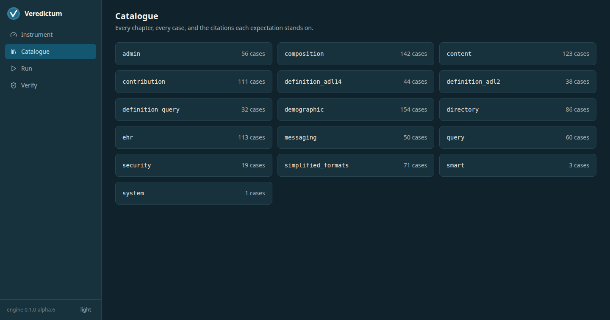

One chapter lists its cases: the identifier, the kind, and the test purpose.
One behaviour per case, so a red row names one defect.

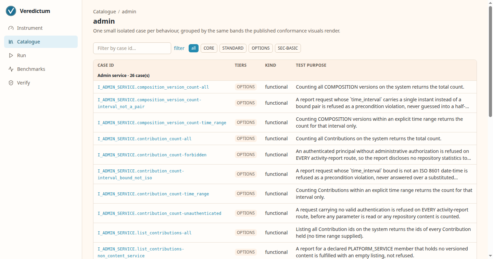
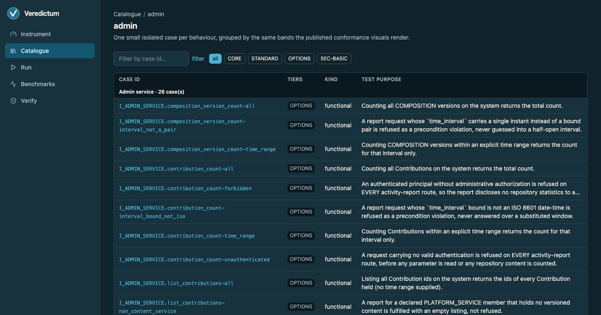

## One case in full

The case detail carries the description, the specification citations the
expectation stands on, the operation bindings that realize it on the wire, and
the corpus fixtures it uses. The citation list is the point: an expectation is
refuted by a better reading of the cited text, and by nothing else.

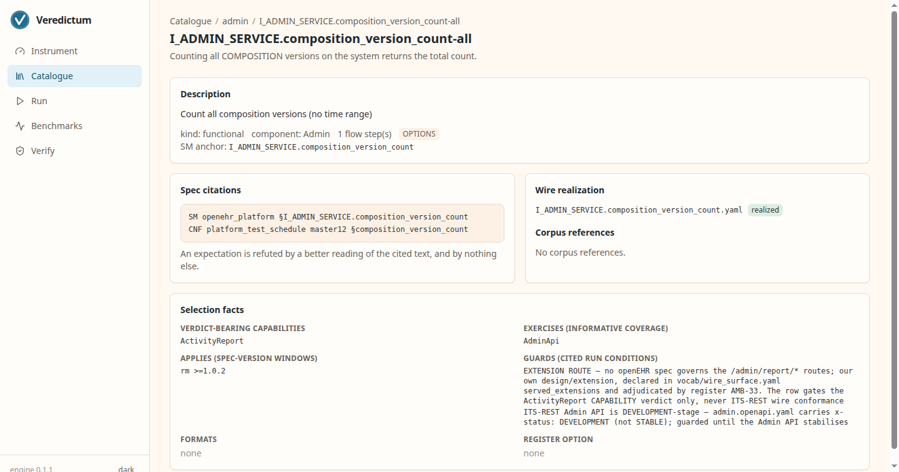
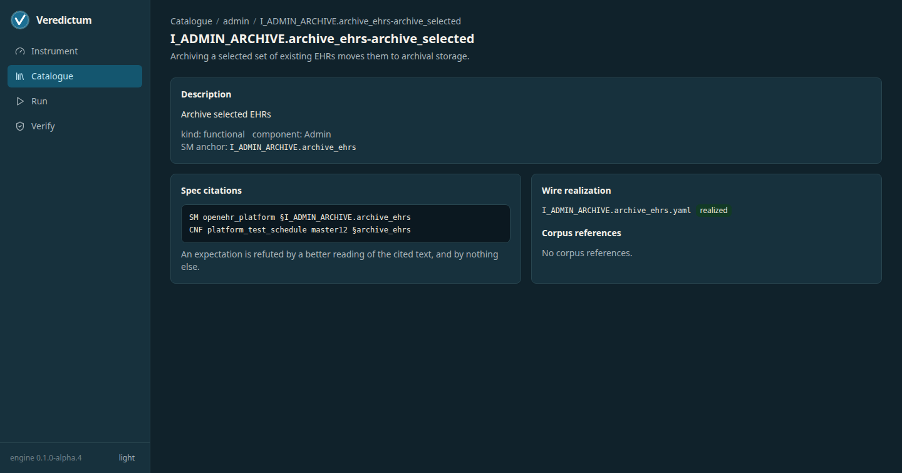

## The run wizard

Grading starts at Connect: the CDR base URL, the display identity, the
authentication choice from the ixit's own vocabulary, and a probe whose
answer renders verbatim before anything continues.

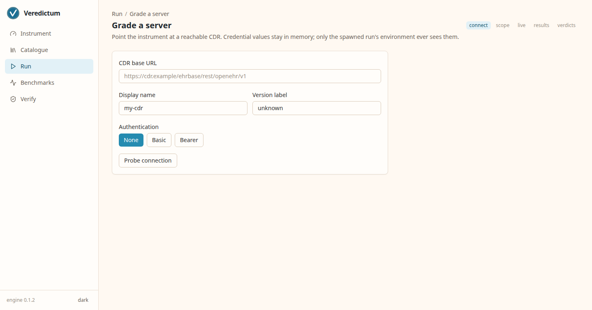
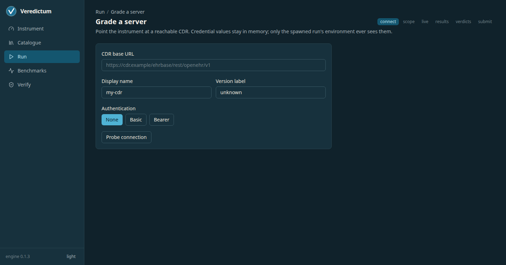

Scope takes the claim the run grades: the vendor's own statement.json (the
ICS, the document that says which profiles and capabilities are claimed),
pasted into the box. The console offers no declaration of its own to load,
because the claim belongs to whoever makes it: ISO/IEC 9646-7 assigns an ICS
proforma's support and supported-values columns to the supplier of the
implementation, and the proforma itself is the capability matrix this
instrument publishes.

The claim can also be built on the screen. The tier row offers CORE, STANDARD,
OPTIONS and SEC-BASIC with the capabilities the capability matrix puts in each
tier and the number of catalogue cases those capabilities gate, counted through
the same matrix walk the judgement computes each profile verdict from.
Composing writes that claim into the same box, product identity taken from the
Connect step, so the operator reads the exact document the run will be graded
against. Option branches stay undeclared there: only the party running the
server knows which branch it realizes.

The document is held to the published statement schema before anything is
stored, and saving answers with the claim overview (product, claimed tiers,
capability count) beside the selection preview, so the screen says what will run
before anything starts. An empty box is an honest no-claim run. The verdict
later certifies exactly the pasted claim against the recorded evidence.

Scope also decides whether the run keeps its wire. "Record the wire exchanges"
is off by default; ticked, the run writes `transcript.json` beside its
`results.json`, carrying every request and response it drove. The artifact
records a server's response bodies verbatim, so it can hold real patient data
from the deployment being graded: it lands in the operator's own output
directory, the sealed record covers it, and the `authorization` request
header's value is withheld.

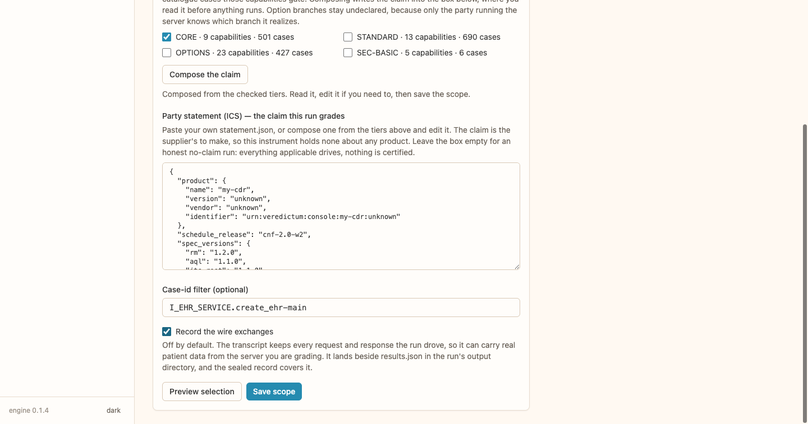

The live screen renders the engine's own progress stream: the case counter,
the elapsed clock, a moving-median estimate labelled as such, and the tail of
the engine's output. When the run finishes the outcome links straight to the
record.

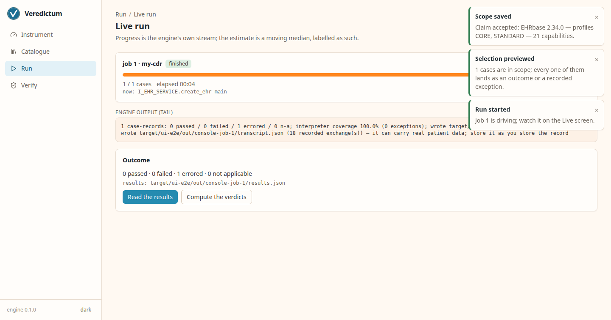

## The record: results and verdicts

Results reads the finished run's own record, red rows first. A row links to
its detail: the recorded reason beside the case's specification citations,
which is what [the attribution](methodology.md#when-a-run-goes-red) of that row
turns on.

The detail ends with the wire. A run driven with the recording box ticked
shows each exchange as its request and response panes, verbatim, which is
where a triage starts. A run driven without it says so in the same place.

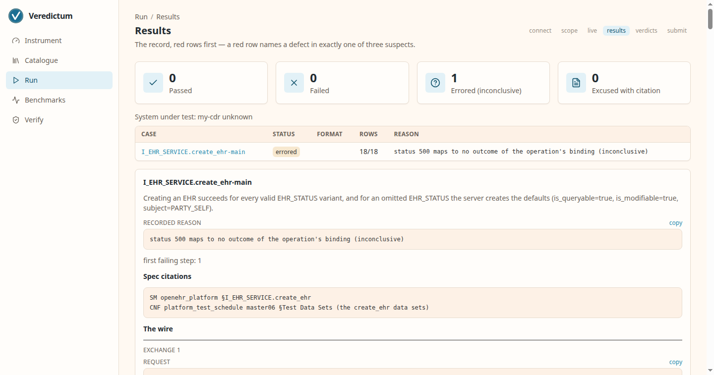

Verdicts is the same pure function the command line runs, over the same
record: the profile matrix with its coverage bounds printed, and the rendered
documents byte-for-byte.

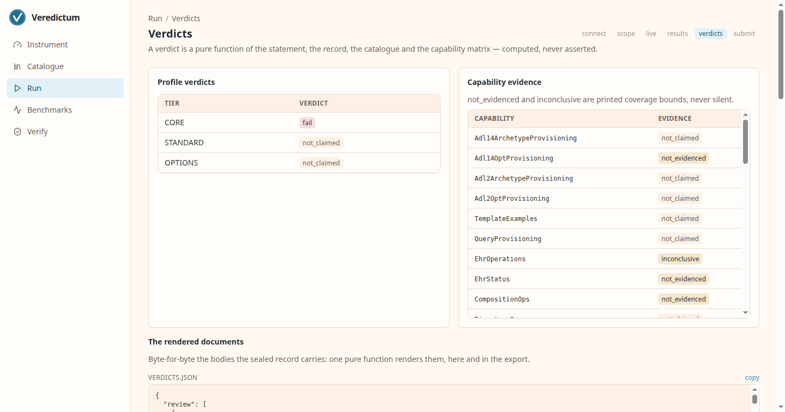
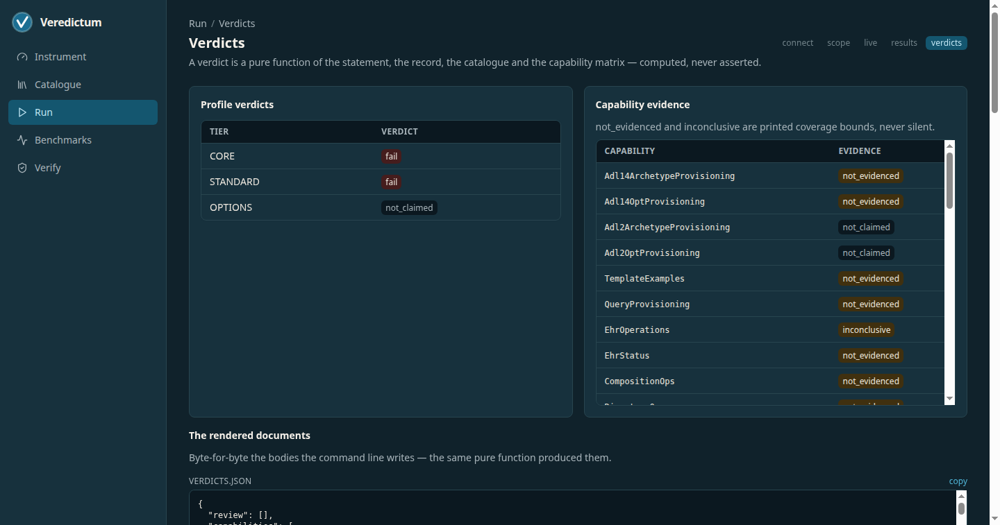

## The export: one signed record

A verdict nobody can check is an opinion. The export step on the verdicts
screen hands the run to the pinned instrument's own `verdicts --sign-key`,
which writes the rendered documents, a digest manifest over them, and a
detached OpenPGP signature over that manifest. The console adds no sealing of
its own; it supplies the key path and reads the result back.

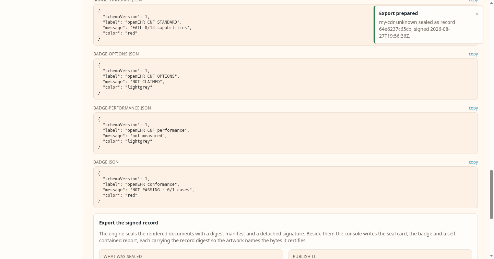

Beside the sealed set the console renders three files a party publishes. Each
carries the record digest prefix, so the artwork names the bytes it certifies
rather than being a logo anyone could copy:

- **The seal card** is the brand's certificate master with its three slots
  filled: the product under test, the profile verdict, and the moment the
  verdict was spoken, read back from the signature's own creation time because
  the record carries no wall clock.
- **The badge** is a compact SVG for a README, with the digest prefix in its
  title and the verify path in its source.
- **The report** is one self-contained HTML file of everything the results and
  verdicts screens show, with the full digest, the signer fingerprint and the
  signing time in its footer.

All three are pure functions of the record: the same bundle in produces the
same bytes out, which is what lets anyone re-render them and compare.

The seal card, the badge and the report sit deliberately outside the manifest.
The manifest covers what the instrument judged; these are renderings about
that judgement, and signing a rendering of a rendering would say nothing extra.

Two keys are configuration. `VEREDICTUM_SIGN_KEY` names the armored secret key
the bundle is sealed with, and `VEREDICTUM_VERIFY_KEY` names the public half.
The console asks for both because it will not print a signing time it has not
checked: after sealing, it verifies its own bundle before stating who signed
it and when. With neither mounted the section says so and offers no button.

## Submit: the run publishes itself

A finished run at the hosted instrument becomes a published record by being
committed to the public results registry. The submit step asks for the
disclosure the submission rules make mandatory and states everything the run
already knows.

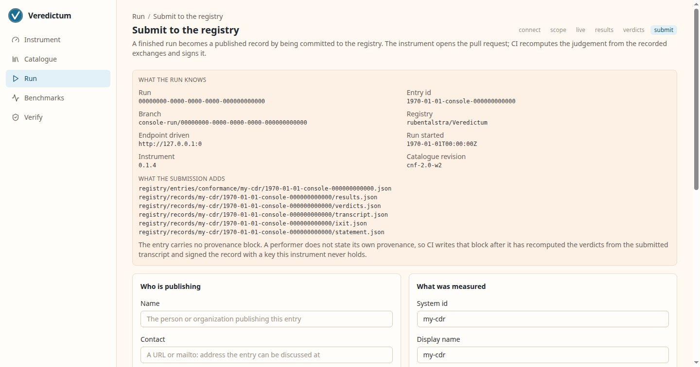
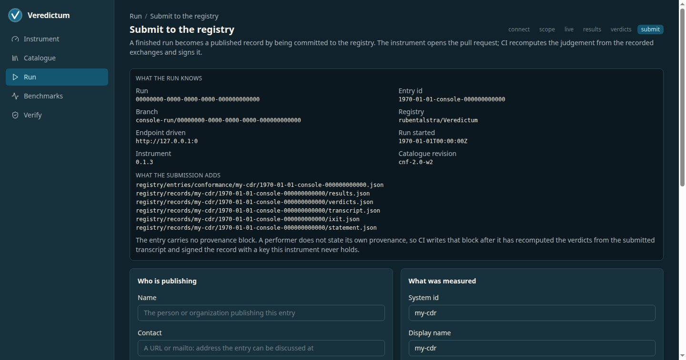

The instrument drove an endpoint you named, so it can say what that server
answered and nothing about the host behind it. That is the split the form is
built on. The run supplies the endpoint it drove, the moment it started, the
catalogue revision its results record names, and the engine version the
console links. You supply who is publishing, the machine the graded server
runs on, what was switched on behind the result, and the conflict-of-interest
sentence the rules give no "not applicable" for. An empty mandatory field is
refused by name before anything is opened.

The submission adds one entry and the five record files a re-derivation reads:
the results, the verdicts, the recorded exchanges, the topology they were
driven under and the claim they were judged against. Each is listed by role
with the SHA-256 of the exact committed bytes. The entry carries no provenance
block, because a performer does not state its own: CI recomputes the verdicts
from the submitted transcript, refuses a mismatch, signs the record with a key
the instrument never holds, and writes that block itself.

No credential the run was driven under reaches the branch. The ixit the record
carries names environment variables, never values, and the recorded exchanges
withhold the credential header.

The identity that opens the pull request is a GitHub App:
`VEREDICTUM_GITHUB_APP_ID`, `VEREDICTUM_GITHUB_APP_KEY`,
`VEREDICTUM_GITHUB_INSTALLATION_ID` and `VEREDICTUM_REGISTRY_REPO`. Its
installation token is short-lived and revocable, which a signing key on a
public host would not be, and it is the only identity permitted to open a
`console` entry. With any of the four unset the step says what to configure
and offers no button.

## Verify: checking a record without trusting us

`/verify` is public. It needs no run, no server and no account: upload a
bundle, and the published library recomputes every digest the manifest names
and checks the detached signature over it.

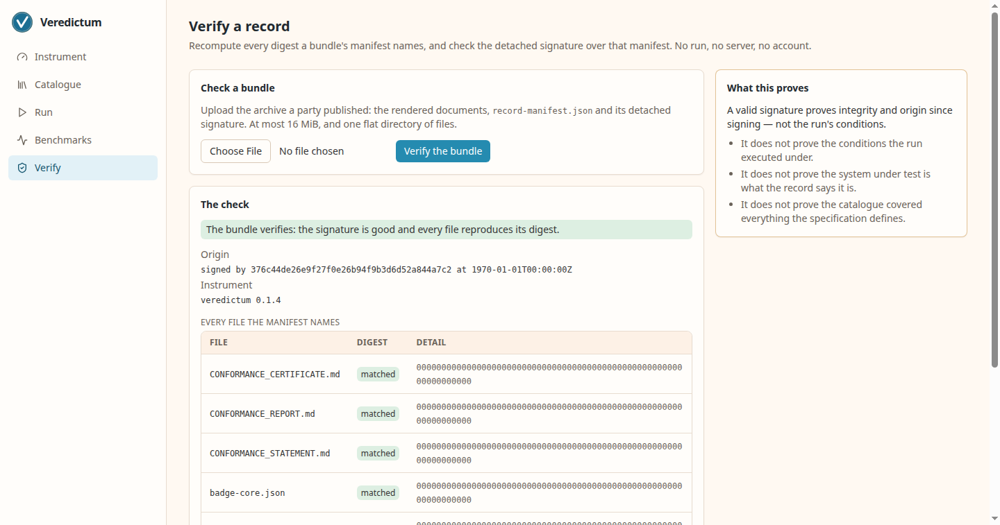
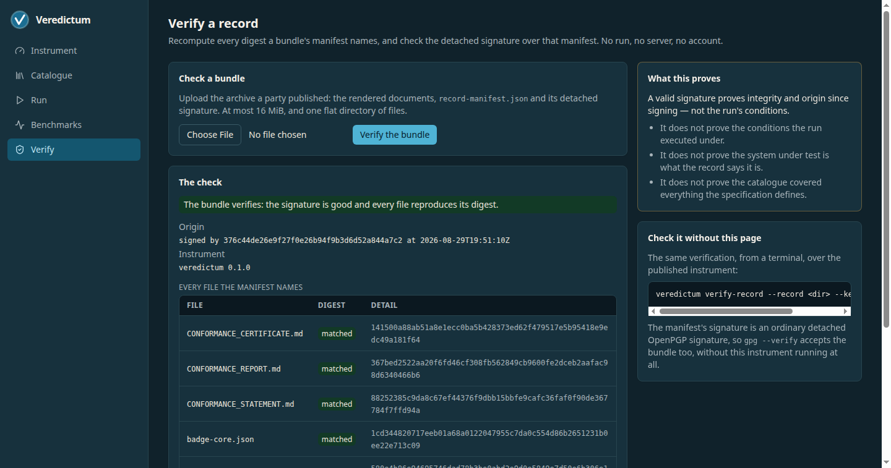

The upload is a plain HTML form posting to a server route. There is no
JavaScript in it, so it works before the client bundle has loaded and works
with scripting switched off. Uploaded bundles are transient: they unpack into
a scratch directory, are checked, and are swept on a short timer.

A tampered file names itself. Change one byte of one document and the row for
that file reads `mismatched`, with the digest the bytes actually produce
beside the digest the manifest promised. Change the manifest instead and the
signature is rejected while every remaining digest still matches, which says
precisely which of the two claims failed.

Two things are permanent furniture on that page. The first is the honesty box,
which renders on every outcome including a clean one: a valid signature proves
integrity and origin since signing, and nothing else. It does not prove the
conditions the run executed under, that the system under test is what the
record says it is, or that the catalogue covered everything the specification
defines. The second is the command line that does the same job:

```text
veredictum verify-record --record <dir> --key <public-key>
```

The manifest's signature is an ordinary detached OpenPGP signature, so
`gpg --verify` accepts a bundle too. Nobody has to trust this console to check
this console.

The key the page checks against is baked into the image at
`/app/keys/registry-signing.pub.asc`, and `VEREDICTUM_VERIFY_KEY` names it by
default, so a fresh instance verifies a published record with no configuration.
It is the public half of the key that signs a registry record, which is what a
reader needs and all a reader needs. Point that variable at another file to
check records signed by another key.

## Benchmarks: speed records, read as speed records

`/benchmarks` reads the JSON document a `veredictum bench` run writes. It lists
every `bench-result*.json` under the mounted output directory and takes
uploaded ones through the same plain-form mechanism `/verify` uses. An uploaded
batch is transient and swept on a timer, because the console stores nothing of
its own.

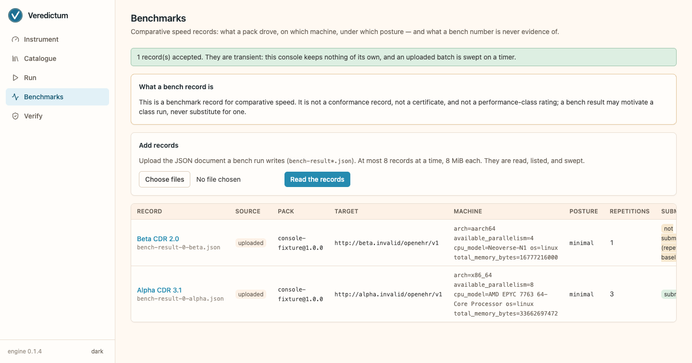
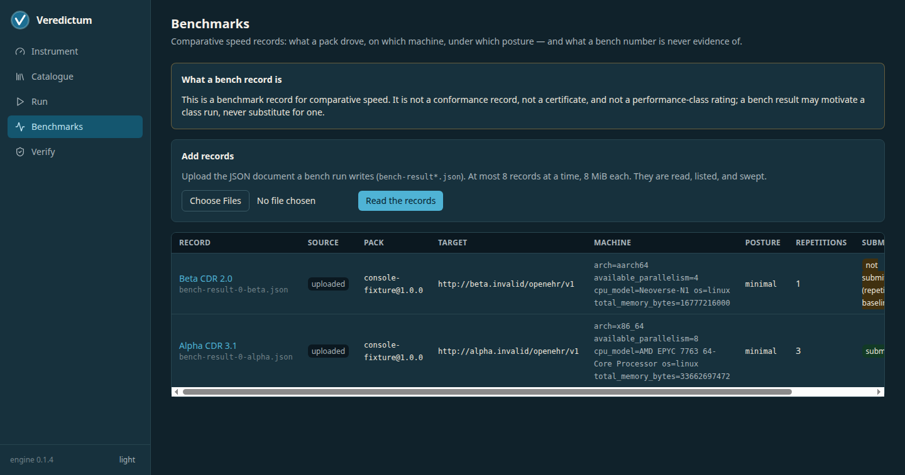

The first thing on every one of these pages is the boundary statement, read
verbatim out of the record: a bench result is a comparative speed measurement,
and it is not a conformance record, not a certificate, and not a
performance-class rating. A table of speed numbers is exactly the artifact
somebody quotes out of context, so the sentence that says what it is not
travels with it.

One record opens in full. The header names the pack, the system, the machine
that offered the load, the seed and the scale, then says whether the record may
be offered for ranking and, when it may not, which requirement it misses and
what that requirement asks for. The posture block follows, one line per
disclosed item, each labelled `verified` where a black-box canary read it off
the running system at both ends of the measured window and `declared-only`
where released ITS-REST discloses nothing to read. Two speed numbers are
comparable only when the same features were switched on behind them, which is
why the posture reads before any figure.

Then the numbers: the cross-repetition percentiles per phase in microseconds
with the millisecond reading beside them, the failed-arrival share of every
repetition and phase on the target and on each baseline, the same-machine
baselines with their pinned image digests and upstream recipe, and the relative
index the run derived against each of them. Every figure carries the discipline
that produced it, because a closed-loop average and an open-loop percentile
answer different questions and are never read against one another.

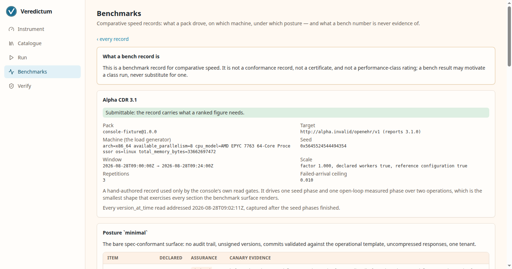

Each operation carries the standard HdrHistogram V2 encoding of its own
latencies, so every percentile on the page is recomputable from the record
itself. The console tabulates rather than draws it: decoding one is the
engine's own histogram reader, which the console reaches once its engine pin
carries the bench module.

Selecting two or more records aligns them side by side, one column per record,
one row per phase, operation and metric. What makes the view worth having is
the block above the numbers: the columns' packs, generator hosts, posture
profiles, full disclosures and scale factors are compared, and every
disagreement is stated before a reader reaches a cell. A column that is not
submittable says so with the requirement it misses; a set of columns taken on
different hosts where one carries no relative index says that nothing in the
table is comparable across them.

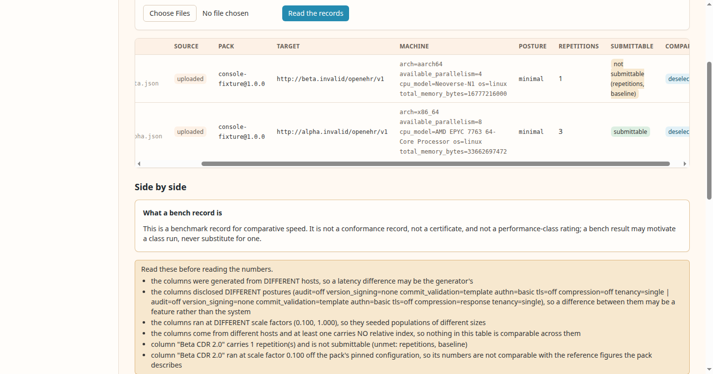

## Running it in public

The hosted instrument at
[console.veredictum.eu](https://console.veredictum.eu) is this console served
publicly, and a public console has two problems a local one does not.

**It drives whatever endpoint a visitor names.** `VEREDICTUM_POSTURE=hosted`
turns on the target guard: loopback, private, link-local, unique-local,
unspecified, multicast, carrier-shared and broadcast addresses are refused in
both families before any socket opens, and the name is resolved first, because
a name under a visitor's control resolving to a private address is the whole
problem. The variable's default is `local`, which refuses nothing — driving a
CDR at `localhost` is the normal local case. A value that is neither refuses
to start, rather than falling back to the permissive one on a typo.

**It has to tell its visitors apart.** With no login, that is the peer address.
Behind a proxy the peer is the proxy, so `VEREDICTUM_CLIENT_IP_HEADER` names
the header carrying the real client address — and only a header the operator
names is read, because an unconditionally trusted `X-Forwarded-For` would let
any visitor claim any identity and defeat the per-visitor caps. Unset, the
socket peer is the whole answer.

Both are documented with the rest of the hosted posture in the repository's
`deploy/hosted/` directory.

## An address the console does not serve

A path outside the route tree answers `404` and renders it: the same chrome,
the path that missed named back to you, and two ways on. Nothing was run and
nothing was judged, which is what the page says.

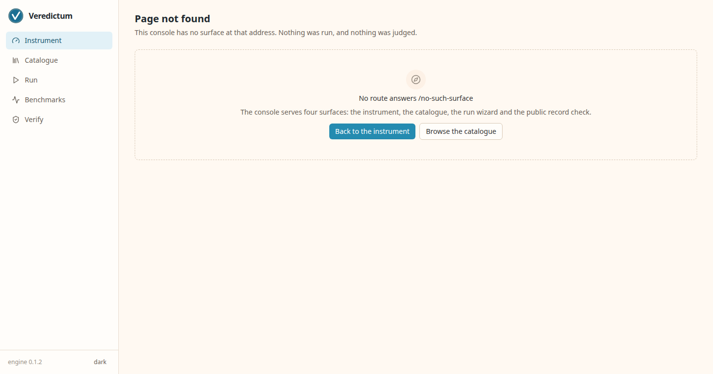
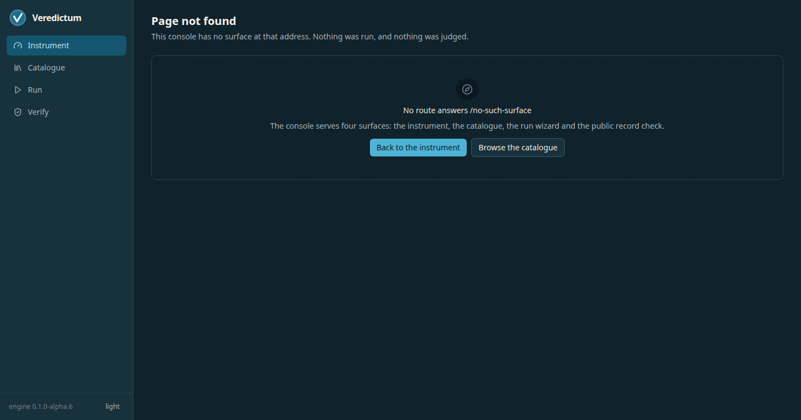

## Two real servers, side by side

The same catalogue, the same wizard and the same judgement, driven against two
live CDRs pulled at their latest published images: FerroEHR's quickstart and
EHRbase's official pairing. The run behind each column is the EHR-service case
family, and every difference below traces to a case id and its citation.

| FerroEHR (latest) | EHRbase (latest) |
|---|---|
| 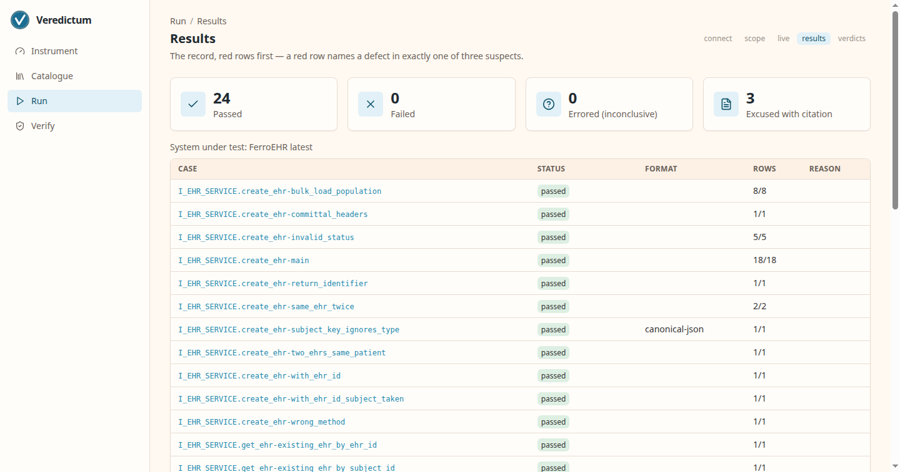 | 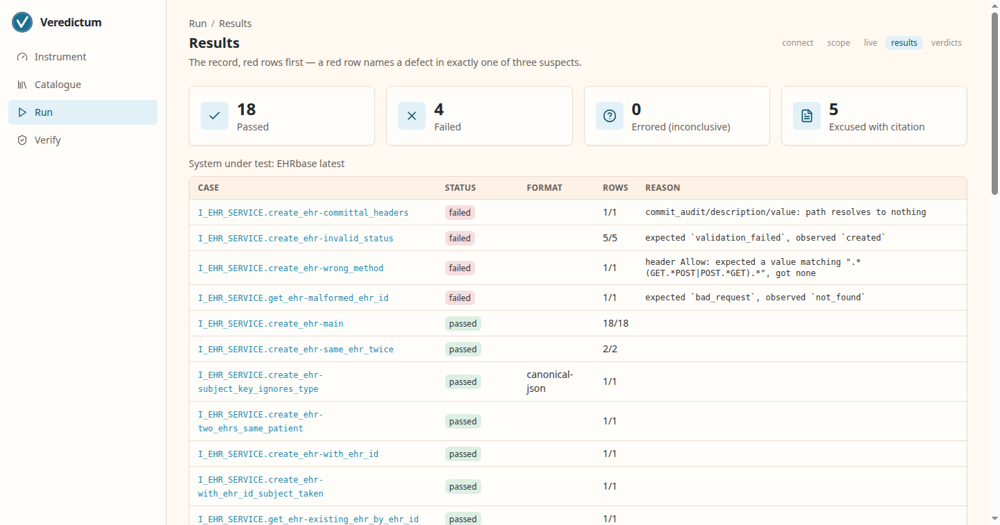 |
| 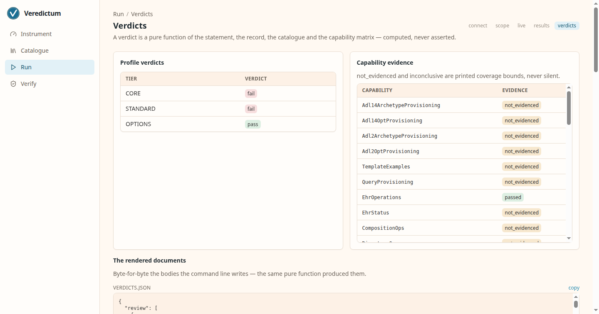 | 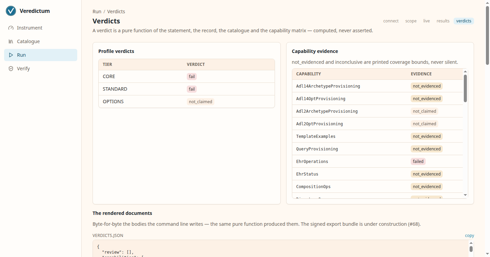 |

These captures come from the same E2E harness that gates the console
(`UI_E2E_REAL_SUTS=1 scripts/ui-e2e.sh`): the browser drives the real wizard
against the real servers, and the book shows what it photographed.
